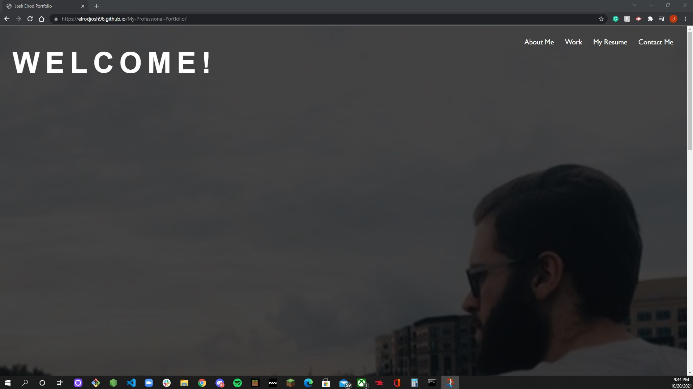
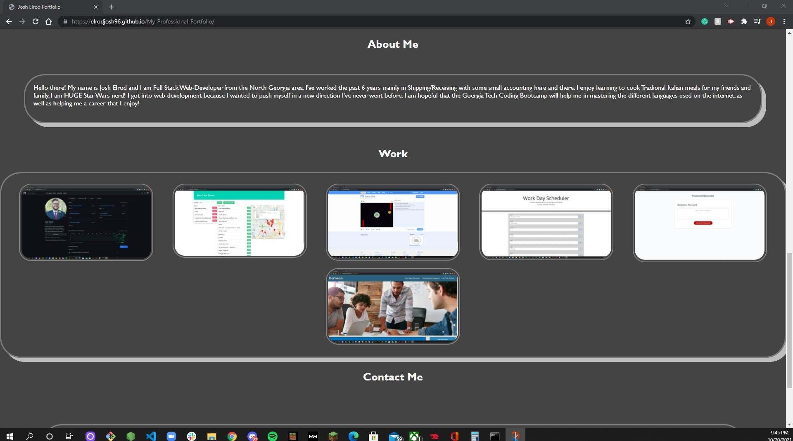
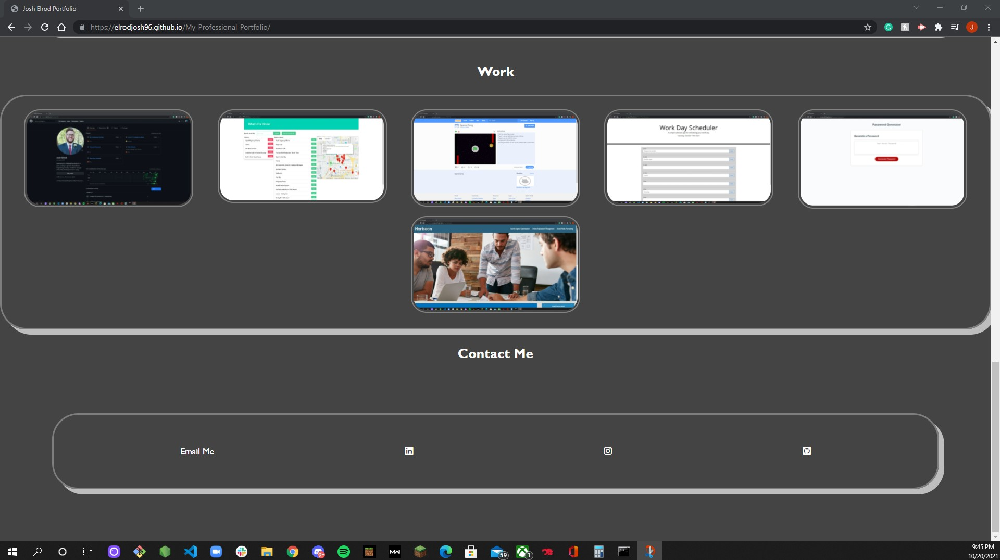

I have created my Professional Web-Development Portfolio! I created this using basic HTML and Advanced CSS code. I have taken my previous page and updated some of the styling on the page and added new projects I have worked on during my boot camp at Georgia Tech.

I have included screenshots of my work that when you click on them, you are brought to the page and can check out the deployed page. 
I've added a link in the nav bar that, once clicked, you can download a copy of my resume. 

I have updated my Resume as well to include links to my Github account and my Linkedin account also. I have also updated my Github account page and pinned my work that I think shows off my skills the most for you to check out!  

Deployed page link:

https://elrodjosh96.github.io/My-Professional-Portfolio/

Links:

Github: https://github.com/elrodjosh96
Linkedin: https://www.linkedin.com/in/josh-elrod
Email me at: elrodjosh96@gmail.com

