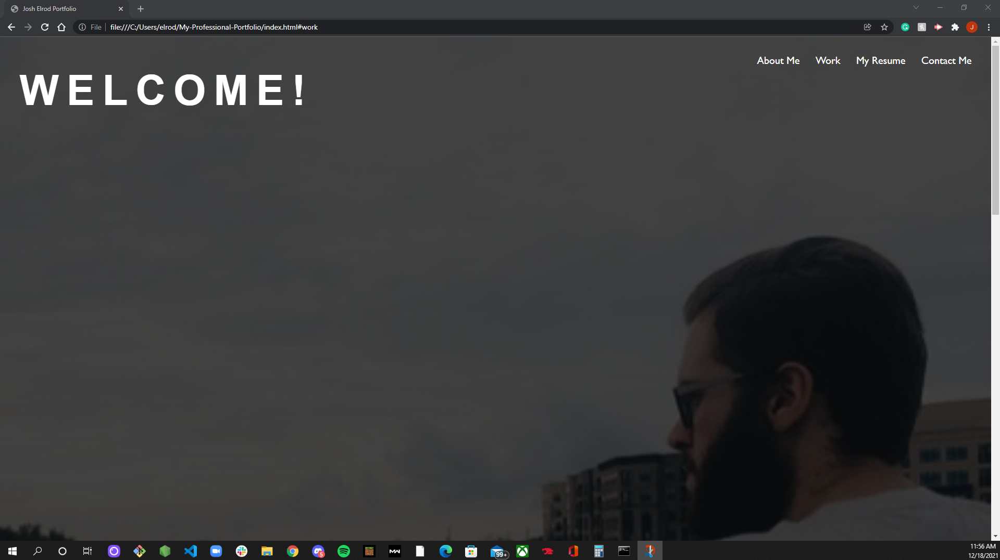
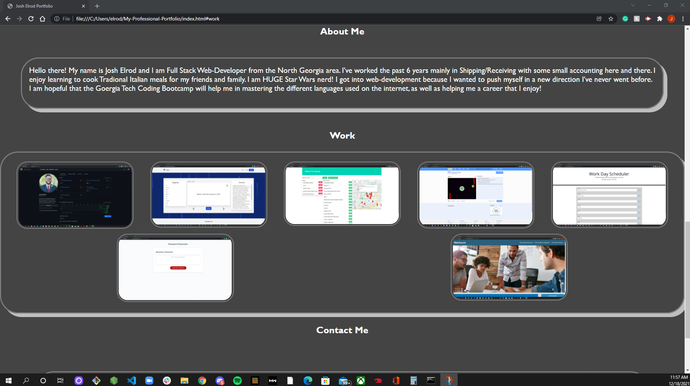
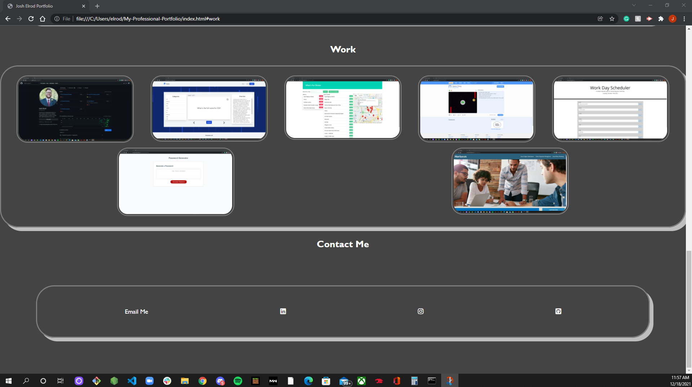

# README Generator 

Deployed page link:

https://elrodjosh96.github.io/My-Professional-Portfolio/

## Table of Contents

* [Description](#description)
* [Installation](#installation)
* [Usage](#usage)
* [Contribution](#contribution)
* [Test](#test)
* [License](#license)
* [Questions](#questions)
* [Screenshots](#screenshots)
* [Links](#links)

## Description
I have created my Professional Web-Development Portfolio! I created this using basic HTML and Advanced CSS code. I have taken my previous page and updated some of the styling on the page and added new projects I have worked on during my boot camp at Georgia Tech.
I have included screenshots of my work that when you click on them, you are brought to the page and can check out the deployed page. 
I've added a link in the nav bar that, once clicked, you can download a copy of my resume.
## Installation

## Usage

## Contribution

## Test 

## License
This app is using Apache License 2.0
## Questions
Email: 
elrodjosh96@gmail.com
Github Username:
elrodjosh96 

## Screenshots

## Links:

Github: https://github.com/elrodjosh96
Linkedin: https://www.linkedin.com/in/josh-elrod
Email me at: elrodjosh96@gmail.com

